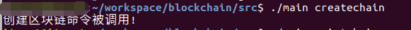
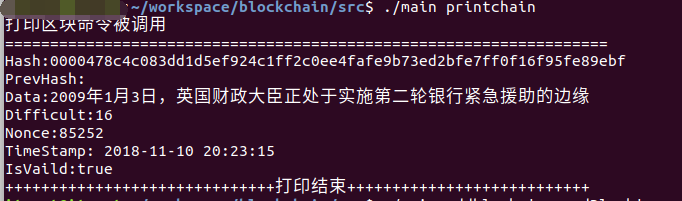
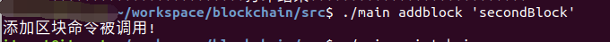
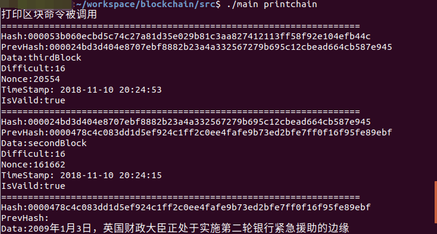

## 比特币区块链的简单模型实现

[](https://github.com/wumansgy)

> ##### 参考比特币的实现原理，利用GO语言构造了一个简单的区块链模型，构造了一些相关的功能。

### 功能及相关

- POW工作量证明
- 基于bolt轻量级数据库

- UTXO实现原理
- 数字签名的验证
- 相关转账功能实现
- 钱包地址的实现
- 钱包地址校验功能

### 使用

1. `git clone https://github.com/wumansgy/btcmodel.git`

2. 选择进入目录

3. `go build main.go`

4. 命令行
   ```
   const Usage = `
   Usage:
   	createwt "创建钱包地址"
   	createbc <ADDRESS> "创建区块链"
   	print "打印区块链"
   	printtx "打印交易"
   	balc <ADDRESS> "获取指定地址余额"
   	send <FROM> <TO> <AMOUNT> "转账"
   	mine [MINER] [DATA] "挖矿"，默认:  
   	list "打印钱包中的所有地址"
   	status "查看当前待确认交易数量"
   `
   ```

   

### 简单功能如下










