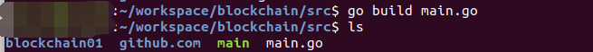

## Implementation of Bitcoin Simple Model

> ##### With  Referring to the implementation principle of Bitcoin, a simple blockchain model is constructed using GO language to construct some related functions.

## function

- POW
- Based on bolt lightweight database

## version

- **V1** (Simple function implementation)
- **v2**(Full functionality implementation, including transaction module)**(Not implemented, implemented later)**

## use

1. `go ger github.com/wumansgy/btcmodel`
2. Switch to the directory below
3. `go build main.go`
4. command
   - `./main createBloChain`       (Create New Blockchain)
   - `./main addBlock DATA `        (Add Block)
   - `./main printChain`       (Print Chain)

## as follows

